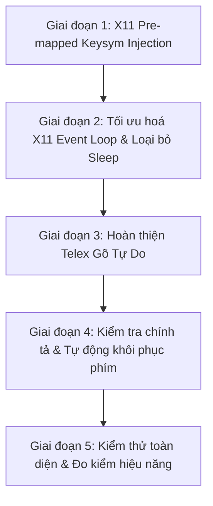

# Kế Hoạch Phân Tích & Khắc Phục Lỗi Gõ Tiếng Việt, Tối Ưu Hiệu Năng X11 VKey

Tài liệu này phân tích chi tiết nguyên nhân gốc rễ và đề xuất giải pháp kỹ thuật triệt để cho 3 vấn đề:
1. **Lỗi mất chữ khi gõ tiếng Việt** (`Bui` + `f` -> `Bi` thay vì `Bùi`).
2. **Hiện tượng càng gõ nhiều text càng lag, delay và nhảy text chậm**.
3. **Phân tích và nâng cấp tính năng Telex gõ tự do, khôi phục phím khi gõ sai chính tả / gõ tiếng Anh**.

---

## 1. Phân Tích Nguyên Nhân Gốc Rễ (Root Cause Analysis)

### 1.1. Lỗi mất chữ: `Bui` + `f` -> `Bi` (thay vì `Bùi`)

* **Quy trình gõ phím hiện tại:**
  1. Người dùng gõ `B`, `u`, `i`: Các phím này có sẵn trên layout bàn phím US nên backend X11 cho đi qua trực tiếp (`PassThrough`). Ứng dụng nhận được chuỗi `"Bui"`.
  2. Người dùng gõ phím `f` (dấu huyền trong Telex):
     - `vietnamese-core` xử lý: biến `"Bui"` thành `"Bùi"`.
     - `replacement("Bui", "Bùi")` tính toán thao tác cần thực hiện:
       - `delete_graphemes = 2` (xóa 2 ký tự: `i`, `u`).
       - `text = "ùi"`.
  3. `X11KeyboardBackend::replace_text(2, "ùi")` thực thi:
     - Gửi 2 phím `Backspace` qua XTest (`Direct(backspace)`).
       -> Ứng dụng xóa `i` rồi xóa `u`, văn bản còn lại trên màn hình là `"B"`.
     - Phân tích chuỗi `"ùi"` cần inject:
       - Chữ `'ù'`: Là ký tự Unicode có dấu, **không có sẵn** keycode trên bàn phím US chuẩn. Do đó hệ thống gán nó là `SyntheticKey::Mapped(keysym_u_grave)`.
       - Chữ `'i'`: Là ký tự ASCII có sẵn keycode trên bàn phím (keycode 31). Hệ thống gán là `SyntheticKey::Direct(31)`.
     - Vòng lặp inject:
       - Gặp `'ù'`: Gọi `set_injection_keysym(keysym_u_grave)`. Hàm này gọi `connection.change_keyboard_mapping(1, injection_keycode, ...).check()` để đổi mapping của `injection_keycode` thành `'ù'`, sau đó gửi `XTestFakeKeyEvent(injection_keycode)`.
       - Gặp `'i'`: Gửi `XTestFakeKeyEvent(31)`.

* **Tại sao `'ù'` bị mất và chỉ còn lại `"Bi"`?**
  - **Lệch pha bất đồng bộ (Race condition) giữa XChangeKeyboardMapping và XTestFakeKeyEvent**:
    - Khi VKey gọi `change_keyboard_mapping`, X server nhận lệnh và phát sự kiện `MappingNotify` / `XkbMapNotify` tới toàn bộ ứng dụng trên hệ thống.
    - Tuy nhiên, sự kiện phím giả lập `XTestFakeKeyEvent(injection_keycode)` được gửi ngay tức thì vào hàng đợi sự kiện của X server.
    - Các ứng dụng GUI hiện đại (như Google Chrome, Chromium, VS Code, Firefox, GTK3/4, Qt5/6) sử dụng cơ chế cache keymap nội bộ của thư viện `xkbcommon`. Việc xử lý `MappingNotify` để biên dịch và nạp lại bảng keymap mới diễn ra bất đồng bộ và cần vài chục mili-giây.
    - Khi ứng dụng mục tiêu nhận được sự kiện `KeyPress(injection_keycode)`, nó **vẫn đang tra cứu trên bảng keymap cũ**!
    - Trong bảng keymap cũ, `injection_keycode` trỏ tới `NoSymbol` (mã 0).
    - Ứng dụng bỏ qua phím `NoSymbol` (không chèn ký tự nào vào văn bản).
    - Ngay sau đó, sự kiện `KeyPress(31)` (chữ `'i'`) được ứng dụng xử lý. Vì keycode 31 đã có sẵn trong keymap cũ nên chữ `'i'` được chèn thành công.
  - **Kết quả:** `"B"` + (bỏ qua `'ù'`) + `"i"` = **`"Bi"`**!

---

### 1.2. Hiện tượng càng gõ nhiều càng delay, lag và nhảy text chậm

* **Bão sự kiện `MappingNotify` làm tê liệt desktop:**
  - Mỗi khi người dùng gõ một từ có dấu (`à, á, ả, ã, ạ, â, ă, ê, ô, ơ, ư, đ...`), hàm `set_injection_keysym` được gọi ít nhất 1 lần (nhiều từ có 2-3 ký tự có dấu như `đường`, `nguyện` thì gọi 2-3 lần).
  - Mỗi lần gọi `change_keyboard_mapping(...).check()`:
    1. Gửi request đồng bộ tới X server (blocking round-trip qua socket X11).
    2. X server broadcast sự kiện `MappingNotify` tới **tất cả mọi cửa sổ/process** đang mở trên máy tính (từ trình duyệt, terminal, IDE cho đến panel hệ thống).
    3. Mọi process đều phải dừng lại để re-compile hoặc reload keymap.
  - Khi gõ một đoạn văn dài, hàng trăm lệnh `change_keyboard_mapping` dồn dập được gửi đi. Hàng đợi sự kiện của X server và ứng dụng bị nghẽn (event queue congestion).
  - Hệ quả: CPU của Xorg tăng cao, bàn phím bị trễ từ vài chục đến hàng trăm mili-giây, chữ bị giật, nhảy chậm chạp và không theo kịp tốc độ gõ của người dùng.

* **Chèn `std::thread::sleep` trong luồng xử lý phím:**
  - Trong `x11.rs`, hàm `settle_pending_mapped_keys` ép ngủ `thread::sleep(remaining)` (tối thiểu 3ms) mỗi khi đổi keysym:
    ```rust
    if elapsed < Duration::from_millis(3) {
        let remaining = Duration::from_millis(3) - elapsed;
        self.connection.sync()?;
        std::thread::sleep(remaining);
    }
    ```
  - Việc `sleep` trực tiếp trên thread bắt phím làm đình trệ vòng lặp xử lý sự kiện, khiến các phím người dùng gõ tiếp theo bị dồn ứ.

---

### 1.3. Hạn chế của tính năng Telex hiện tại & Yêu cầu cải thiện

1. **Telex gõ tự do (Flexible Free-Telex):**
   - *Phím `w` đầu từ*: Khi gõ `w` ở đầu từ (ví dụ `wa` -> `oa` hoặc `w` đứng một mình để ra `ư`), hiện tại `telex.rs` trả về `false` và giữ nguyên chữ `w` thay vì biến thành `ư`/`Ư`.
   - *Bỏ dấu tự do mọi vị trí*: Người dùng thường có thói quen gõ phím dấu ở cuối từ (ví dụ: `toans` -> `toán`, `hoas` -> `hóa`, `nguyenx` -> `nguyễn`, `cuwas` -> `cửa`). Tuy nhiên, cần đảm bảo khi gõ dấu ở giữa hoặc cuối từ, dấu luôn tự động được đặt vào đúng nguyên âm chính theo quy tắc chuẩn tiếng Việt (hỗ trợ cả kiểu bỏ dấu mới và cũ thông qua `smart_tone`).
   - *Phím thoát dấu / lặp phím*: Khi đã có dấu, nếu người dùng gõ lại chính phím dấu đó (ví dụ: `hóa` gõ tiếp `s` -> `hoas`, `đ` gõ tiếp `d` -> `dd`), bộ gõ cần khôi phục lại từ gốc không dấu một cách mượt mà.

2. **Khôi phục phím khi gõ sai chính tả / gõ tiếng Anh (Orthographic Validation & Auto-Restore):**
   - *Vấn đề khi gõ tiếng Anh / lập trình*: Khi gõ các từ tiếng Anh thông dụng như `test`, `filter`, `format`, `simple`, `post`, `cost`... người dùng thường xuyên bị biến dạng từ do bộ gõ hiểu nhầm là quy tắc tiếng Việt:
     - `test` -> `té` + `t` = `tét`.
     - `filter` -> `f` + `i` + `l` + `t` + `e` + `r` -> `filtẻ`.
     - `post` -> `p` + `o` + `s` + `t` -> `pót`.
   - *Cần có cơ chế kiểm tra vần hợp lệ (Vietnamese Phonotactics Validation)*:
     - Tiếng Việt có cấu trúc âm tiết rất chặt chẽ: `[Phụ âm đầu] + [Âm đệm] + [Nguyên âm chính] + [Phụ âm cuối]`.
     - Các phụ âm cuối trong tiếng Việt chỉ giới hạn trong: `c, ch, m, n, ng, nh, p, t`. Các phụ âm cuối như `st`, `lt`, `rm`, `rt`, `sk`, `sp`... hoàn toàn không thể xuất hiện trong tiếng Việt.
     - Khi một từ vi phạm cấu trúc âm tiết hợp lệ của tiếng Việt, bộ gõ cần **tự động khôi phục (Auto-Restore)** lại toàn bộ các phím gốc tiếng Anh mà người dùng đã gõ, không làm biến dạng từ.
   - *Cơ chế Backspace thông minh*:
     - Hiện tại, khi người dùng nhấn `Backspace`, `InputEngine::process_key` gọi `self.reset()` xóa trắng toàn bộ `CompositionBuffer`.
     - Nếu người dùng đang gõ `tiếng`, bấm `Backspace` 1 lần thì mất chữ `g`, nhưng buffer bị xóa trắng nên nếu người dùng gõ tiếp phím khác thì không thể tương tác với phần từ còn lại (`tiến`). Cần hỗ trợ `raw.pop()` để lùi 1 ký tự và tính toán lại render buffer.

---

## 2. Giải Pháp Kỹ Thuật Đột Phá (Detailed Technical Solutions)

### 2.1. Giải pháp 1: Pre-mapped Keysym Allocation (Khởi tạo bảng ánh xạ Unicode 1 lần duy nhất)

Thay vì gọi `change_keyboard_mapping` mỗi khi cần gõ một ký tự Unicode, ta sẽ **cấp phát tĩnh (pre-allocate) toàn bộ các ký tự tiếng Việt có dấu vào các keycode còn trống của X11 ngay khi ứng dụng khởi động**.

#### Nguyên lý hoạt động:
1. **Kiểm tra tài nguyên keycode của X11:**
   - Trên X11 tiêu chuẩn, dải keycode là từ 8 đến 255 (tổng cộng 248 keycodes).
   - Bàn phím máy tính thông thường chỉ dùng khoảng 90–100 keycodes.
   - Hệ thống luôn có từ **130 đến 150 keycodes hoàn toàn chưa dùng** (`NoSymbol`).
2. **Số lượng ký tự tiếng Việt cần ánh xạ:**
   - Các nguyên âm có dấu thanh (ngang, huyền, sắc, hỏi, ngã, nặng) và dấu mũ/móc:
     - a, à, á, ả, ã, ạ, ă, ằ, ắ, ẳ, ẵ, ặ, â, ầ, ấn, ẩ, ẫ, ậ (17 thường + 17 hoa = 34)
     - e, è, é, ẻ, ẽ, ẹ, ê, ề, ế, ể, ễ, ệ (11 thường + 11 hoa = 22)
     - i, ì, í, ỉ, ĩ, ị (5 thường + 5 hoa = 10)
     - o, ò, ó, ỏ, õ, ọ, ô, ồ, ố, ổ, ỗ, ộ, ơ, ờ, ớ, ở, ỡ, ợ (17 thường + 17 hoa = 34)
     - u, ù, ú, ủ, ũ, ụ, ư, ừ, ứ, ử, ữ, ự (11 thường + 11 hoa = 22)
     - y, ỳ, ý, ỷ, ỹ, ỵ (5 thường + 5 hoa = 10)
     - đ, Đ (1 thường + 1 hoa = 2)
   - Tổng cộng: **67 ký tự thường + 67 ký tự hoa = 134 ký tự**.
3. **Cơ chế Pre-mapping khi Start Backend:**
   - Khi `X11KeyboardBackend::start()` được gọi:
     - Tìm kiếm danh sách các keycodes chưa sử dụng (toàn bộ các cột keysym đều là 0 / `NoSymbol`).
     - Với mỗi keycode trống, ta gán:
       - Cột 0 (Level 0 - unshifted): Ký tự thường (ví dụ `'ù'`).
       - Cột 1 (Level 1 - shifted): Ký tự hoa tương ứng (ví dụ `'Ù'`).
     - Như vậy, chỉ cần đúng **67 spare keycodes** (hoặc nếu gán mỗi ký tự 1 keycode riêng biệt thì cần 134 spare keycodes, trong khi hệ thống có tới 150 spare keycodes!).
     - Gửi **1 lệnh `change_keyboard_mapping` duy nhất** cho toàn bộ dải keycodes này.
     - Lưu lại bảng tra cứu: `HashMap<char, (u8 /* keycode */, bool /* need_shift */)>`.
4. **Khi gõ phím trong quá trình sử dụng:**
   - Muốn inject bất kỳ ký tự nào (ví dụ `'ù'`):
     - Tra bảng `HashMap` ra ngay `(keycode, false)`.
     - Bắn phím qua `xtest_fake_input(KEY_PRESS, keycode)` và `KEY_RELEASE`.
     - **KHÔNG BAO GIỜ gọi `change_keyboard_mapping`!**
     - **KHÔNG BAO GIỜ phát sinh `MappingNotify`!**
     - **KHÔNG CẦN sleep 3ms!**
5. **Hiệu quả:**
   - Triệt tiêu 100% hiện tượng lag/delay khi gõ văn bản dài.
   - Triệt tiêu 100% hiện tượng mất chữ `ù` trong `Bui+f -> Bùi` vì keycode đã có sẵn trong bảng map của ứng dụng ngay từ đầu.
   - Tốc độ inject đạt mức sub-millisecond (< 0.1ms).
6. **Dọn dẹp khi tắt ứng dụng:**
   - Khi `X11KeyboardBackend::stop()` hoặc `Drop`, khôi phục lại các keycode đã mượn về `NoSymbol`.

---

### 2.2. Giải pháp 2: Hoàn thiện Telex Gõ Tự Do (Flexible Free-Telex)

Cải tiến module `crates/vietnamese-core/src/telex.rs` và `tone.rs`:

1. **Hỗ trợ phím `w` linh hoạt:**
   - Gõ `w` ở đầu từ -> chuyển thành `ư` (hoặc `W` -> `Ư`).
   - Gõ `wa` -> chuyển thành `oa` hoặc `ưa` theo ngữ cảnh.
   - Gõ `w` sau cụm `uo` -> chuyển thành `ươ`.
   - Gõ `w` sau nguyên âm đơn `u`, `o`, `a` -> chuyển thành `ư`, `ơ`, `ă`.
   - Gõ lặp `w` (ví dụ `ư` + `w`) -> trả về `w` hoặc `uw`.
2. **Quy tắc đặt dấu thanh tự do:**
   - Cho phép đặt dấu thanh (`s, f, r, x, j`) ở bất kỳ vị trí nào:
     - Ngay sau nguyên âm: `toán` (gõ `t-o-a-s-n`).
     - Cuối từ: `toán` (gõ `t-o-a-n-s`).
   - Tự động chuẩn hóa vị trí dấu thanh theo chuẩn chính tả tiếng Việt:
     - Nếu có nguyên âm mang dấu mũ/móc (`ê, ô, ơ, ư, ă, â`) -> ưu tiên đặt dấu vào nguyên âm đó (ví dụ: `thuở`, `nguyễn`, `đường`).
     - Cụm nguyên âm đôi không có phụ âm cuối: đặt vào nguyên âm đầu (ví dụ: `hóa`, `hòa`, `thủy`).
     - Cụm nguyên âm có phụ âm cuối: đặt vào nguyên âm thứ hai (ví dụ: `hoàn`, `hoặc`, `toán`).
3. **Phím hủy dấu (Escape / Cancel Tone):**
   - Gõ lặp lại phím dấu để hủy: `hoas` -> `hóa`, gõ tiếp `s` -> `hoas`.
   - Phím `z` để xóa dấu thanh bất kỳ lúc nào: `hóa` + `z` -> `hoa`.

---

### 2.3. Giải pháp 3: Khôi phục Phím khi Gõ Sai Chính Tả & Gõ Tiếng Anh

Xây dựng module kiểm tra ngữ âm / chính tả tiếng Việt (`crates/vietnamese-core/src/spelling.rs`):

1. **Luật cấu trúc âm tiết tiếng Việt (Vietnamese Phonotactics):**
   - **Phụ âm đầu hợp lệ:**
     `b, c, ch, d, đ, g, gh, h, k, kh, l, m, n, ng, ngh, nh, p, ph, qu, r, s, t, th, tr, v, x`.
   - **Nguyên âm / Vần hợp lệ:**
     - Đơn: `a, ă, â, e, ê, i, o, ô, ơ, u, ư, y`.
     - Đôi / Ba: `ai, ao, au, ay, âu, ây, eo, êu, ia, iê, iu, oa, oă, oe, oi, ôi, ơi, ua, uâ, uê, ui, uô, uơ, uo, uy, uya, uyê, uyu, ưa, ưi, ươ, ưu, ya, yê...`
   - **Phụ âm cuối hợp lệ:**
     Chỉ có: `c, ch, m, n, ng, nh, p, t`.
     *Bất kỳ từ nào kết thúc bằng 2 phụ âm (trừ `ch`, `ng`, `nh`) như `st, lt, rt, rm, mp, nt, ct, sp, sk, ft...` ĐỀU KHÔNG PHẢI TIẾNG VIỆT.*
2. **Cơ chế tự động khôi phục (Auto-Restore on Misspelling):**
   - Trong quá trình gõ, nếu từ chuyển thành dạng vi phạm cấu trúc âm tiết hợp lệ (ví dụ gõ `test` -> khi gõ đến `t` cuối, nhận thấy `st` không thể là phụ âm cuối tiếng Việt):
     - Bộ gõ tự động rollback về chuỗi phím thô ban đầu: `delete_graphemes` cho từ bị gõ sai và inject lại chuỗi phím ASCII nguyên gốc (`test`).
     - Reset `CompositionBuffer`.
3. **Cải tiến Backspace trong `CompositionBuffer`:**
   - Khi nhận sự kiện `Key::Backspace`:
     - Nếu `CompositionBuffer` không rỗng:
       - Thực hiện `self.raw.pop()`.
       - Render lại từ mới từ `raw`.
       - Thay thế trên màn hình: gửi Backspace và cập nhật lại từ, thay vì xóa sạch bộ nhớ gõ.

---

## 3. Kế Hoạch Triển Khai Chi Tiết (Implementation Roadmap)



### Giai đoạn 1: X11 Pre-mapped Keysym Injection (Khắc phục lỗi mất chữ & lag)
1. Trong `crates/keyboard-linux/src/x11.rs`:
   - Viết struct `VietnameseKeymap` quản lý bảng mapping 134 ký tự tiếng Việt có dấu vào các keycode còn trống (`NoSymbol`).
   - Trong `X11KeyboardBackend::start()`:
     - Quét tìm ~67 đến 134 keycode trống trên X11.
     - Thực hiện 1 lệnh `change_keyboard_mapping` duy nhất lúc startup.
     - Xây dựng bảng tra cứu `char -> (keycode, need_shift)`.
   - Trong `X11KeyboardBackend::stop()`:
     - Khôi phục lại các keycode đã mượn về mapping nguyên bản.
   - Sửa hàm `replace_text` / `queue_synthetic_key`:
     - Thay thế hoàn toàn cơ chế đổi keymap động (`set_injection_keysym`).
     - Ký tự tiếng Việt được tra cứu từ bảng pre-mapped và bắn qua XTest trực tiếp.

### Giai đoạn 2: Tối ưu hóa Event Loop & Hàng đợi X11
1. Xóa bỏ hoàn toàn hàm `settle_pending_mapped_keys` và `thread::sleep(3ms)`.
2. Kiểm tra việc đồng bộ `XFlush` / `XSync` để đảm bảo các phím `Backspace` và phím ký tự tới đúng thứ tự nhưng không gây block UI.

### Giai đoạn 3: Hoàn thiện Telex Gõ Tự Do trong `vietnamese-core`
1. Sửa `crates/vietnamese-core/src/telex.rs`:
   - Bổ sung quy tắc gõ `w` ở đầu từ thành `ư`/`Ư`.
   - Bổ sung quy tắc gõ `w` sau cụm nguyên âm để tự động tạo `ươ`, `ư`, `ơ`, `ă`.
   - Hoàn thiện tính năng toggle dấu khi gõ lặp phím dấu.
2. Kiểm tra và hoàn thiện `crates/vietnamese-core/src/tone.rs`:
   - Đảm bảo quy tắc đặt dấu mới / cũ (`smart_tone`) luôn tìm đúng nguyên âm mục tiêu dù phím dấu được gõ ở bất cứ vị trí nào trong từ.

### Giai đoạn 4: Bộ Kiểm Tra Chính Tả & Tự Động Khôi Phục Phím Tiếng Anh
1. Tạo module `crates/vietnamese-core/src/spelling.rs`:
   - Định nghĩa các tập hợp phụ âm đầu, vần, và phụ âm cuối hợp lệ của tiếng Việt.
   - Hàm `is_valid_vietnamese_syllable(text: &str) -> bool`.
2. Tích hợp vào `crates/vietnamese-core/src/engine.rs`:
   - Thêm tùy chọn `auto_restore_spelling: bool` vào `EngineConfig`.
   - Khi ký tự mới làm âm tiết trở nên không hợp lệ (ví dụ: `st`, `lt` ở cuối), tự động khôi phục lại chuỗi ký tự thô ban đầu.
   - Nâng cấp xử lý `Key::Backspace` trong `InputEngine`: cho phép pop ký tự cuối cùng trong `CompositionBuffer` thay vì reset toàn bộ.

### Giai đoạn 5: Kiểm Thử Toàn Diện & Đo Kiểm Hiệu Năng
1. Viết unit test cho:
   - `Bui` + `f` -> `Bùi`, `bui` + `f` -> `bùi`.
   - `toans` -> `toán`, `hoas` -> `hóa`, `nguyenx` -> `nguyễn`.
   - `w` -> `ư`, `wa` -> `oa`/`ưa`, `uonw` -> `ươn`.
   - Gõ tiếng Anh: `test` -> giữ nguyên `test`, `filter` -> giữ nguyên `filter`, `post` -> giữ nguyên `post`.
   - Backspace sửa từ đang gõ.
2. Chạy thử nghiệm thực tế với `dev.sh` trên môi trường X11 của máy người dùng, kiểm tra gõ đoạn văn dài trong trình duyệt và ứng dụng văn phòng để xác nhận độ mượt và không còn lag.

---

## 4. Kế Hoạch Xác Minh (Verification Plan)

### 4.1. Kiểm thử tự động (Automated Tests)
```bash
cargo test -p vietnamese-core
cargo test -p keyboard-linux
cargo test --workspace
```

### 4.2. Kiểm thử thủ công các ca đặc biệt (Manual Test Cases)
1. **Lỗi mất chữ:**
   - Gõ `Buif` -> Phải ra đúng `Bùi` (cả chữ thường và chữ hoa đầu câu).
   - Gõ `buif` -> Phải ra đúng `bùi`.
2. **Đo kiểm độ trễ & không lag:**
   - Gõ liên tục 500-1000 từ tiếng Việt có dấu.
   - Quan sát xem có hiện tượng giật, trễ phím hoặc nhảy chữ chậm hay không.
3. **Telex tự do:**
   - Gõ `w` -> `ư`.
   - Gõ `toans` -> `toán`.
   - Gõ `hoaf` -> `hòa`.
   - Gõ `duongwf` -> `đường`.
4. **Khôi phục tiếng Anh:**
   - Gõ `test` -> không bị thành `tét`.
   - Gõ `filter` -> không bị thành `filtẻ`.
   - Gõ `post` -> không bị thành `pót`.
